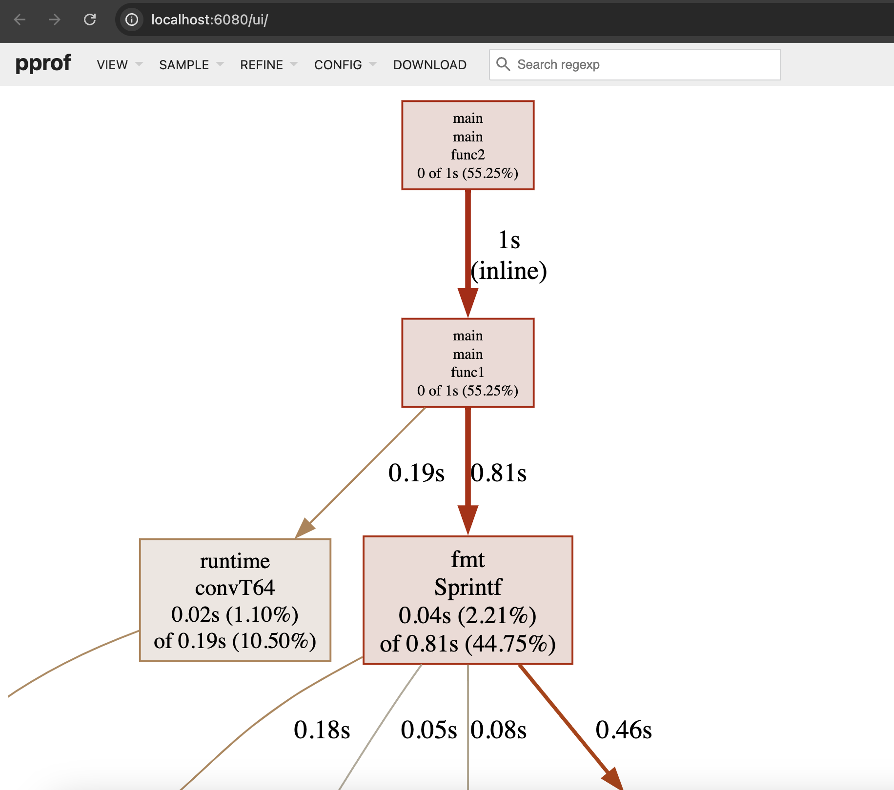

# basic-pprof



I use Go's in-built `pprof` for profiling CPU, memory, and other performance characteristics.

_worker_ in this context is some computation I would normally profile.

## How to use:

Run the server and visit http://localhost:6060/debug/pprof/

## You can also dump data using:

```bash
curl -o heap.pprof http://localhost:6060/debug/pprof/heap?seconds=10
curl -o cpu.pprof http://localhost:6060/debug/pprof/profile?seconds=10
```

## `pprof` rich Graphics (via `graphviz`)

If you don't already have graphviz, You can install:

#### linux

```bash
sudo apt-get install graphviz
```

#### mac

```bash
brew install graphviz
```

### View Graphics on the browser

```bash
go tool pprof -http=:6080 cpu_profile.pprof
```
